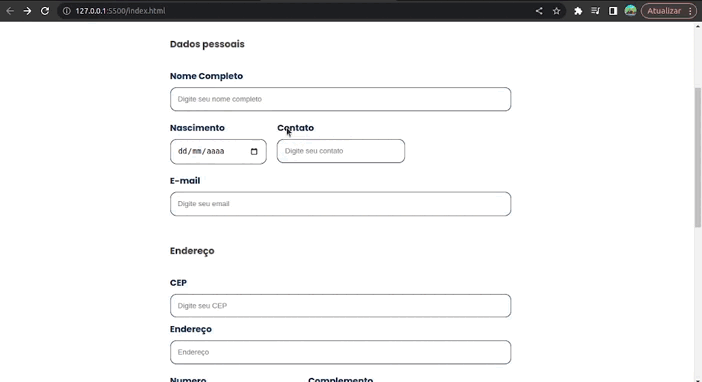

# Alura Books - Form (CEP)

## Sobre:

Este repositório contém um projeto em JavaScript que facilita a inserção automática de CEPs em um formulário utilizando uma API externa.

Ao preencher formulários com informações de endereço, a inserção do CEP pode ser uma tarefa tediosa e suscetível a erros. Este projeto visa resolver esse problema, automatizando o preenchimento do campo de CEP por meio de uma integração com uma API externa de CEP.

## Layout:



## Como executar o projeto?

Os passos para acessar o projeto são bem simples, mas seguem a seguinte ordem:

```bash
# Terminal

git clone https://github.com/MateusMaciel340/alurabooks-form-cep

cd alurabooks-form-cep/

```

## Tecnologias

As seguintes ferramentas foram utilizadas na construção do projeto:

### Frontend

- HTML
- CSS
- JavaScript
  
## Contribuidores

<table>
    <thead>
        <tr>
            <td>
                
            </td>
        </tr>
    </thead>
    <tbody>
        <tr>
            <th>Mateus Maciel</th>
        </tr>
    </tbody>
</table>

## Como contribuir?

1. Faça um fork do projeto.
2. Crie uma nova ramificação com suas alterações: `git checkout -b minha-feature`
3. Salve as alterações e crie uma mensagem de confirmação contando o que você fez: `git commit -m "arquivo modificado"`
4. Envie suas alterações: `git push origin minha-feature`

## Licença

Este projeto é licenciado sob a licença Alura Cursos.